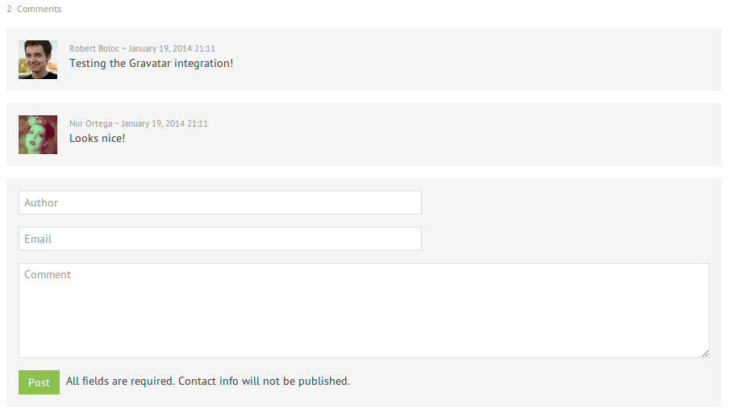

# RbComment
[](https://travis-ci.org/robertboloc/RbComment)
[](https://scrutinizer-ci.com/g/robertboloc/RbComment/)
[](https://scrutinizer-ci.com/g/robertboloc/RbComment/)

Zend Framework 2 module for drop-in, self-hosted comments, with
email notifications, Akismet, ZfcUser and Gravatar integration.

## Table of contents
- [Installation](#installation)
- [Usage](#usage)
- [Themes](#themes)
- [Configuration](#configuration)
- [Roadmap](#roadmap)
- [Preview](#preview)
- [Notes](#notes)

## Installation

1. Add the module key to your `composer.json` file
```json
    {
        "require": {
            "robertboloc/rbcomment": "1.2.0"
        }
    }
```

2. Run `composer update`

3. Import the schema from `data/schema.sql` into your database.

4. Add the new module to your application's modules list in `config/application.config.php`
```php
    'modules' => array(
        'Application',
        'RbComment', // Add this
    ),
```

## Usage

In your views use the `rbComment` helper to display the count, the list and a form for adding new comments. Invoke it
where you want your comments box to appear. Simple isn't it? This helper can be used in any view.

```php
<?php echo $this->rbComment($theme) ?>
```
The `$theme` parameter is used to specify the theme of the comments box (if none is specified `default` is used).

Currently, the module is designed to allow only one comment box per page, as it uses
the page uri to identify a thread.


## Themes

The module comes with 2 themes for now. To implement new ones create a new partial using
as base the existing ones.

Use your new theme calling `$this->rbComment('yourpartial')`

The current themes (and possible values of the `$theme` parameter if not using a custom partial) are :

#### default
Basic theme with no external dependencies. Contains the minimum styling to make it look decent.

#### uikit
This theme requires the [UIkit](http://www.getuikit.com/) CSS framework. If you use it in your project this theme
will make your comments box look awesome.


## Configuration

The default configuration of the module can be found in the file `config/module.config.php`.
To override the defaults, add your values under the `rb_comment` key in the `config/autoload/local.php` file
of your application, using the same structure as in the defaults.

Currently the configurable parameters are:

#### default_visibility
This parameter controls the visibility of the newly published comments. If set to 1 all new published comments will be
visible. If 0 they will not be shown. This is useful for moderation.

#### strings
This array contains the translations for the strings used in the comments box. To change or translate to another language
override these values with your own.

#### email
This array contains email notifications parameters
```php
'email' => array(
    /**
     * Send email notifications.
     */
    'notify' => false,
    /**
     * Email addresses where to send the notification.
     */
    'to' => array(),
    /**
     * From header. Usually something like noreply@myserver.com
     */
    'from' => '',
    /**
     * Subject of the notification email.
     */
    'subject' => 'New Comment',
    /**
     * Text of the comment link.
     */
    'context_link_text' => 'See this comment in context',
),
```
For sending the emails the module uses a service factory called `RbComment\Mailer`. As a default it configures a sendmail transport. This should be changed in production and customized to your needs (probably with smtp). To do this rewrite the service factory in your `config/autoload/global.php` file.
```php
'service_manager' => array(
    'factories' => array(
        /**
         * Placeholder transport config. Do not use this in production.
         * Replace with smtp.
         */
        'RbComment\Mailer' => function () {
            return new Zend\Mail\Transport\Sendmail();
        },
    ),
),
```
#### akismet

The module provides integration with the Akismet service. Comments marked as
spam will be hidden (not deleted) and no notification will be sent. To use this
feature  the following params must be configured:

```php
'akismet' => array(
    /**
     * If this is true, the comment will be checked for spam.
     */
    'enabled' => false,
    /**
     * Your Akismet api key.
     */
    'api_key' => '',
    /**
     * Akismet uses IP addresses. If you are behind a proxy this SHOULD
     * be configured to avoid false positives.
     * Uses the class \Zend\Http\PhpEnvironment\RemoteAddress
     */
    'proxy' => array(
        /**
         * Use proxy addresses or not.
         */
        'use' => false,
        /**
         * List of trusted proxy IP addresses.
         */
        'trusted' => array(
        ),
        /**
         * HTTP header to introspect for proxies.
         */
        'header' => 'X-Forwarded-For',
    ),
),
```
#### zfc_user

By default the ZfcUser integration is disabled. To use it you must update this flag in your config file.

```php
'zfc_user' => array(
    /**
     * This enables the ZfcUser integration.
     */
    'enabled' => false,
),
```

#### gravatar

By default the Gravatar integration is disabled. To use it you must update this flag in your config file.

```php
'gravatar' => array(
    /**
     * This enables the Gravatar integration.
     */
    'enabled' => false,
),
```

## Roadmap

If you want to contribute to the development of this module and don't know where to start you can
pick one of this tasks :

* Allow multiple instances of the comments box on the same page
* Use AJAX for storing/retrieving comments
* Emoji integration
* Make module CLI aware
  * Automate removal of spam with a cron task
* Block spammers by IP
* More themes

## Preview



## Notes

If you are using the BjyAuthorize module (or any other route restricting module)
make sure the route `rbcomment` is publicly accessible.